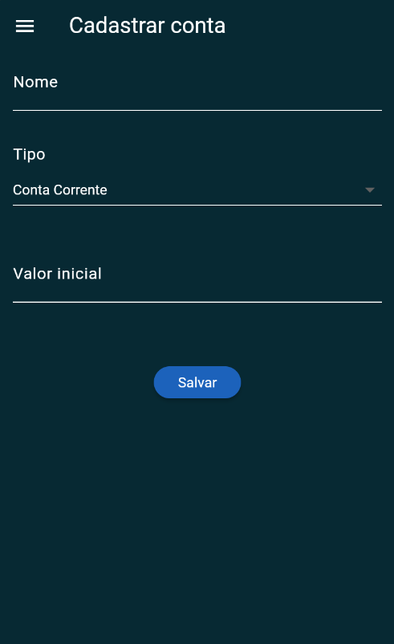

# InVelop app


## Description
This is a project created by Henrique Pedrozo, Felique Siqueira, Jefferson Santos and Roberto Costa for the Mobile Engineering discipline to prove our abilities with flutter framework.

It consistis in a personal financial control app, based on envelopes method where the user can stablish a budget for each envelope, which in turn, represents a spending category of his life. 


## Installation

Install Flutter:
Open a command prompt or PowerShell window.
Run the following command to download and install Flutter:
``` 
git clone https://github.com/flutter/flutter.git
```

Add the Flutter bin directory to your system PATH:
Navigate to the cloned Flutter directory (e.g., C:\path\to\flutter).
Run flutter doctor to verify that Flutter is correctly installed and to check for any additional requirements.

```bash
git clone https://github.com/InVelop/invelop-app.git
flutter run
```

## Usage
The first step to start using the system, is to register. For it, we used firebase which is responsible for all the login management.

After that, the user will come across with the budget page. There, he will see all spending categories he has created once (the first time he logs in, there will be some categories as example). The user can expand each categorie to see his spendings in detail.

In the top left side, the user can find a menu button, where he can navigate between all funccionalites of the system (Budget page, My Accounts, Create account, Transactions).

You can find some images of the project above.





